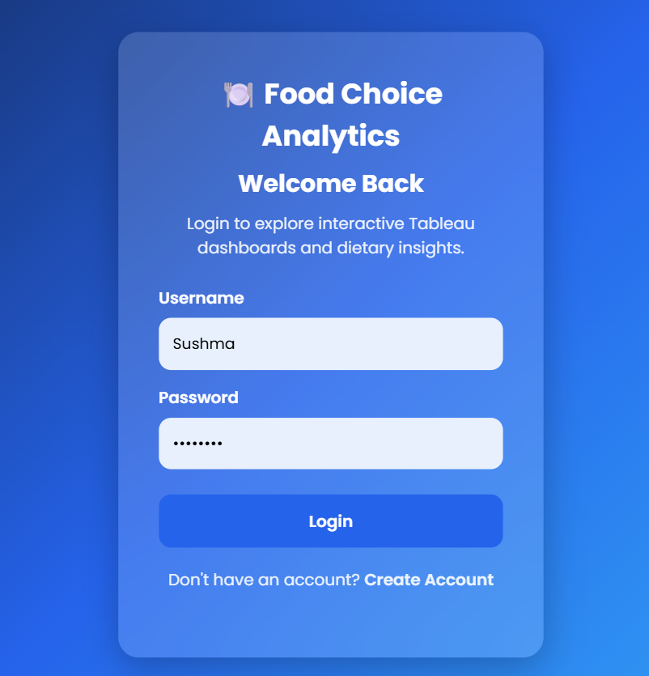
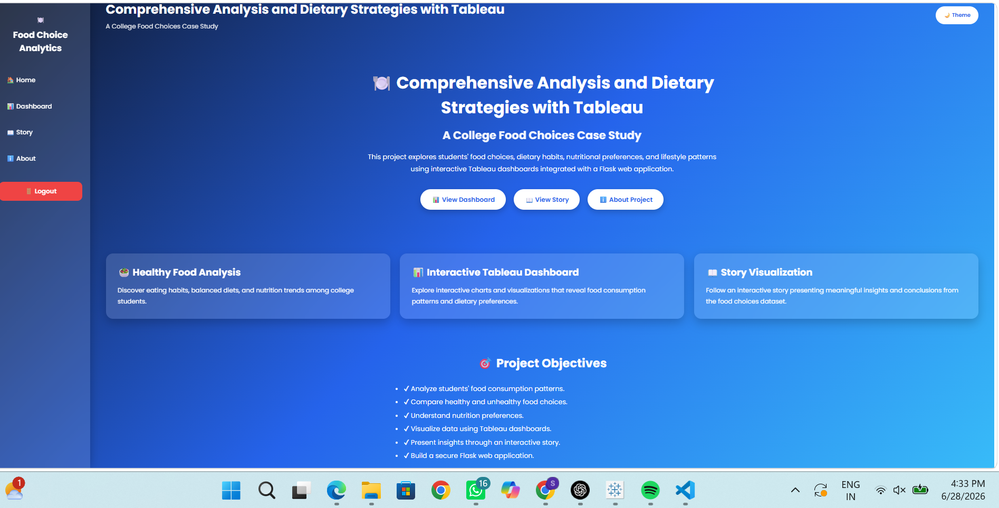
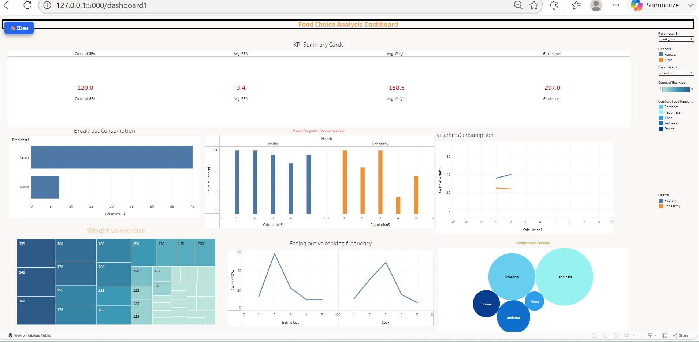
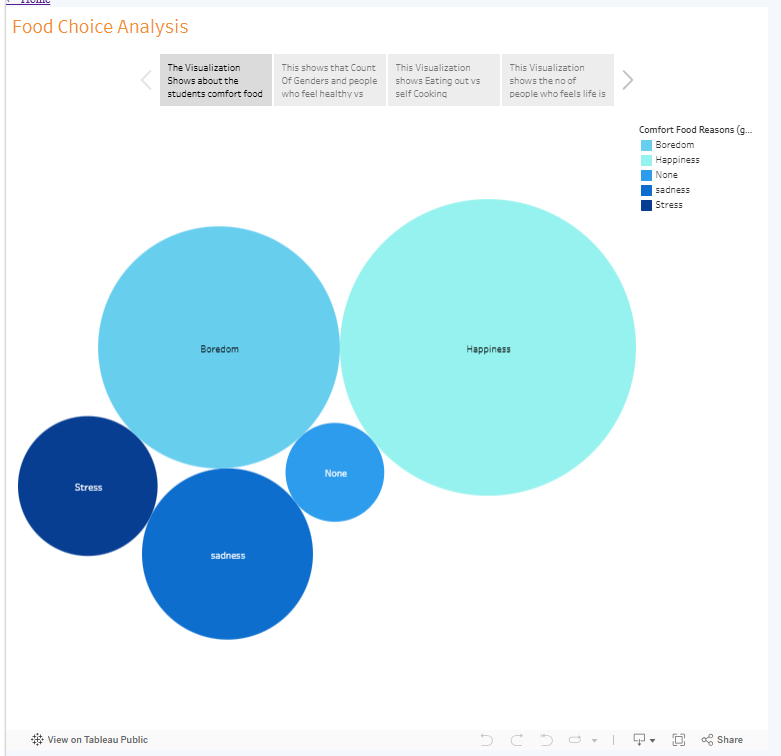

# 🍽️ Comprehensive Analysis and Dietary Strategies with Tableau: A College Food Choices Case Study

<p align="center">


</p>

---

# 📖 Project Overview

The **Comprehensive Analysis and Dietary Strategies with Tableau: A College Food Choices Case Study** is an interactive Business Intelligence project developed using **Tableau Public** and **Flask**.

This project explores the relationship between college students' dietary habits, food preferences, nutritional awareness, lifestyle choices, and eating patterns using interactive dashboards and visual storytelling.

The application combines Tableau dashboards with a Flask web application to deliver a responsive and user-friendly analytics platform.

---

# 🎯 Problem Statement

College students often develop unhealthy dietary habits because of academic workload, busy schedules, stress, and lifestyle choices.

This project analyzes survey data to understand:

- Healthy and unhealthy eating habits
- Food preferences
- Calorie awareness
- Lifestyle patterns
- Nutrition behavior
- Student dietary decisions

The dashboards provide meaningful insights through interactive visualizations that help users better understand student nutrition trends.

---

# 🎯 Objectives

- 📊 Analyze college food choices
- 🥗 Study dietary habits
- 🍕 Compare food preferences
- 📈 Build interactive Tableau dashboards
- 🌐 Integrate Tableau with Flask
- 💻 Create a responsive web application
- 📖 Present insights using Tableau Story

---

# ✨ Key Features

- 🔐 User Login & Registration
- 📊 Interactive Tableau Dashboard
- 📖 Tableau Story Visualization
- 📱 Responsive User Interface
- 💾 SQLite Database
- 🔒 Secure Flask Authentication
- ⚡ Fast Navigation
- 🌐 Render Deployment Ready

---

# 🚀 Live Demo

### 🌍 Render Deployment

> **YOUR_RENDER_LINK_HERE**

Live Demo

Render Deployment:
https://food-case-analysis-1.onrender.com

---

# 🎥 Project Demonstration

### Demo Video

> [**Add your Google Drive Demo Video Link here**
](https://drive.google.com/file/d/1d_ToMkbCwmhLZ-d8cycIj2wJNIPwOvlN/view?usp=sharing)
---

# 📸 Application Preview

## 🔐 Login Page


---

## 📝 Register Page



---

## 🏠 Home Page



---

## 📊 Dashboard



---

## 📖 Tableau Story



---
# 📊 Tableau Public

## 📈 Interactive Dashboard

🔗 https://public.tableau.com/views/Book2_17826390323580/Dashboard1?:language=en-US&publish=yes&:display_count=n&:origin=viz_share_link

---

## 📖 Tableau Story

🔗 https://public.tableau.com/views/Book1_17826389600130/Story1?:language=en-US&publish=yes&:display_count=n&:origin=viz_share_link

---

# 🛠️ Technology Stack

| Technology | Purpose |
|------------|---------|
| 🐍 Python | Backend Development |
| 🌐 Flask | Web Framework |
| 📊 Tableau Public | Data Visualization |
| 💾 SQLite | Database |
| 🎨 HTML5 | Frontend |
| 🎨 CSS3 | Styling |
| ⚡ JavaScript | Client-side Interactivity |
| ☁️ Render | Cloud Deployment |
| 🔧 Git & GitHub | Version Control |

---

# 📂 Project Structure

```text
Food_Choices_Case_Study
│
├── Assets
│   ├── login.png
│   ├── register.png
│   ├── home.png
│   ├── dashboard1.png
│   └── story.png
│
├── Dataset
│
├── Documentation
│
├── demo_video
│
├── instance
│   └── users.db
│
├── static
│   ├── style.css
│   └── script.js
│
├── templates
│   ├── base.html
│   ├── home.html
│   ├── login.html
│   ├── register.html
│   ├── about.html
│   ├── dashboard1.html
│   └── story.html
│
├── app.py
├── requirements.txt
├── Procfile
└── README.md
```

---

# ⚙️ Installation

### Clone Repository

```bash
git clone YOUR_GITHUB_REPOSITORY_LINK
```

### Open Project

```bash
cd Food_Choices_Case_Study
```

### Install Dependencies

```bash
pip install -r requirements.txt
```

### Run Flask Application

```bash
python app.py
```

Open your browser:

```
http://127.0.0.1:5000
```

---

# 📦 Requirements

- Python 3.11+
- Flask
- Flask-SQLAlchemy
- SQLAlchemy
- Werkzeug
- Gunicorn

---

# 🌟 Highlights

- Interactive Business Intelligence Dashboards
- Flask Authentication System
- Secure Login & Registration
- SQLite Database Integration
- Responsive User Interface
- Tableau Public Dashboard Embedding
- Tableau Story Visualization
- Ready for GitHub & Render Deployment

---
# 👥 Team

| Name | Role |
|------|------|
| Jahnavi Thupati | Team Lead |
| Tejaswini Sushma Chamana | Developer |
| Guggilapu Monika Naga Vaishnavi | Member |
| Ajith Vardhanapu | Member |
| Gunti Vinay | Member |

---

# 🚀 Future Scope

- 🤖 AI-powered dietary recommendation system
- 📈 Machine Learning prediction models
- 📱 Mobile responsive dashboard
- ☁️ Cloud database integration
- 📊 Advanced Tableau dashboards
- 🔍 Real-time nutrition analytics
- 🍎 Personalized food recommendation engine
- 📉 Predictive health risk analysis
- 🌍 Public health monitoring dashboard
- 📡 Live API integration

---

# 📚 Documentation

This repository includes complete project documentation.

- ✅ Ideation Phase
- ✅ Requirement Analysis
- ✅ Project Design
- ✅ Project Planning
- ✅ Project Development
- ✅ Performance Testing
- ✅ Final Project Documentation

---

# 📽️ Demo Video

🎥 Google Drive

Paste your Google Drive video link here.

```
https://YOUR_GOOGLE_DRIVE_LINK
```

---

# 🌐 Live Demo

Render Deployment

```
https://YOUR_RENDER_LINK
```

(Add after deployment)

---

# 📄 License

This project is developed for educational and academic purposes under the MIT License.

---

# 🙏 Acknowledgements

Special thanks to

- SkillWallet
- Tableau Public
- Flask Community
- Python Community
- Open Source Contributors

---

# 👩‍💻 Developed By

**Tejaswini Sushma Chamana**

B.Tech Student

Passionate about

- Data Analytics
- Tableau
- Business Intelligence
- Python Development
- Web Development

---

## ⭐ Support

If you like this project,

⭐ Star this repository.

🍴 Fork this repository.

📢 Share it with others.

---

# 📬 Contact

GitHub

```
https://github.com/YOUR_GITHUB_USERNAME
```

Tableau Public

```
https://public.tableau.com/
```

---

<div align="center">

## 🌟 Thank You for Visiting 🌟

### Comprehensive Analysis and Dietary Strategies with Tableau:
### A College Food Choices Case Study

Made with ❤️ using Python, Flask and Tableau Public.

</div>
